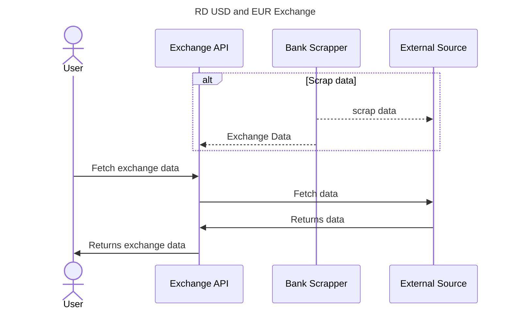

# DOP Exchange API

TODO

## Diagram

```mermaid
---
title: RD USD and EUR Exchange
---
sequenceDiagram
    actor user as User
	participant api as Exchange API
    participant scrapper as Bank Scrapper
    participant source as External Source
    alt Scrap data
        scrapper -->> source: scrap data
        scrapper -->> api: Exchange Data
    end
    user ->> api: Fetch exchange data
    api ->> source: Fetch data
    source ->> api: Returns data
    api ->> user: Returns exchange data
```